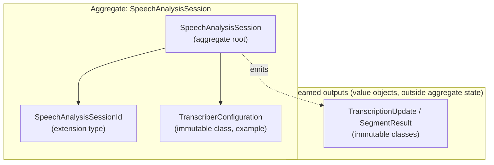

# Domain Model: Speech Analysis (SpeechAnalyzer pipeline)

This document defines the **bounded context**, proposed **aggregate**, **entities** (if any), and **value objects** for on-device speech analysis using Apple’s **`SpeechAnalyzer` + `SpeechTranscriber` + `AssetInventory`** API. **Scalar handles** should use **Dart extension types** where appropriate; **multi-field** concepts use **immutable classes**.

## Bounded context

**Speech analysis (module pipeline)**: Configuring and running a **single** `SpeechAnalyzer` session (one input sequence at a time per Apple’s model), ensuring **locale assets** are available, feeding **time-coded audio** (`AnalyzerInput`), and consuming **module results** (e.g. transcription text and time ranges). Boundaries:

- **In scope**: Transcription-oriented modules (`SpeechTranscriber`, `DictationTranscriber` if exposed), optional non-transcription modules (`SpeechDetector`, etc.), **asset inventory** status/install, **session lifecycle** (analyze, finalize, cancel).
- **Out of scope**: Legacy **`SFSpeechRecognizer`** / task API; **translation**, **summarization**, **LLM post-processing**, and **arbitrary audio encoding**—callers handle those outside this package.
- **Apple types**: Domain names are **Dart** names; map to `SpeechAnalyzer`, `SpeechTranscriber`, `AssetInventory`, `AnalyzerInput` in infrastructure only.

---

## Aggregate: SpeechAnalysisSession (aggregate root)

**Aggregate root**: `SpeechAnalysisSession` (conceptual target; implement when the native bridge lands).

**Consistency boundary**: One logical **analysis session** matches one native analyzer configuration for a **single input sequence** (aligned with Apple: the analyzer consumes one stream at a time). The root holds:

- Immutable **module configuration** for that session (e.g. transcriber locale and preset/options snapshot).
- Opaque **session handle** (maps to native `SpeechAnalyzer` / coordinator)—see `SpeechAnalysisSessionId`.

**Invariants** (target):

- Session is created only after **asset readiness** is satisfied for the configured modules (or the app explicitly opts into a flow that installs/downloads assets first).
- **Finalize or cancel** is explicit: callers must end sessions per Apple semantics (`finalizeAndFinish`, `cancelAndFinishNow`, etc.); document pairing with Dart subscription cancellation.
- **No legacy pipeline**: Domain and application layers must not model `SFSpeechRecognitionTask` or recognizer-centric flows.

**Lifecycle**: `prepared` → `analyzing` → `finalized` | `cancelled` | `failed`. Immutable snapshots where useful; native ownership stays in infrastructure.

---

## Entities

Prefer **value objects** and the **session aggregate** first. Add **entities** only when something has **identity** across time beyond the session (e.g. a durable “reserved locale slot” if modeled explicitly). Initially **no extra entities** are required; **`SpeechAnalysisSession`** is the single root.

---

## Value objects

### Identifier / handle value objects (extension types)

| Value object | Representation | Purpose |
|--------------|----------------|---------|
| **SpeechAnalysisSessionId** | `int` (or `String` if native uses UUID) | Opaque id for one session; factory validates non-empty / positive per chosen mapping. |

Adjust the representation once the FFI/Swift boundary defines the handle shape.

### Configuration and status (immutable classes or enums)

| Value object | Purpose |
|--------------|---------|
| **TranscriberConfiguration** | Snapshot of locale + preset/options needed to construct `SpeechTranscriber` (and siblings) on the native side. |
| **AssetInventoryStatus** | Model-install state relevant to callers (mirrors `AssetInventory.Status` conceptually). |
| **AnalysisSessionState** | Sealed type or enum for prepared / analyzing / finalized / cancelled / failed. |

### Result chunks (immutable classes)

Module results are **streamed**; model them as **immutable value objects** passed to Dart `Stream` consumers (not stored inside the aggregate).

| Value object | Purpose |
|--------------|---------|
| **TranscriptionUpdate** | Progressive or final text plus timing metadata (e.g. range in audio timeline, confidence if exposed). Map from `SpeechTranscriber.Result` in infrastructure. |
| **VolatileRangeHint** | If surfacing analyzer “volatile range” callbacks, use a small immutable type (start/end time). |

Use Dart `Duration` or dedicated time-range types with validation (finite, non-negative length) as appropriate.

---

## Domain errors

- **`SpeechKitException`** (or similarly named) lives in **domain/errors/**: user-meaningful failures (permission denied, unsupported OS, unsupported locale, asset install failure, analyzer errors). Infrastructure maps native errors into this type.

---

## Rules

1. **No legacy API in domain/application**: Do not model `SFSpeechRecognizer`, `SFSpeechRecognitionRequest`, or task delegates as first-class domain types.
2. **Session boundary**: Treat **one `SpeechAnalyzer` session** as the **aggregate** consistency boundary; do not split the same native session across multiple roots.
3. **Streamed results**: Transcription (and other module) outputs are **value objects** emitted over time; they are **not** part of the aggregate’s persisted in-memory graph (same idea as `CapturedFrame` vs `ShareableContent` in screen-capture-kit).
4. **Extension types**: Use **extension types** for opaque scalar handles; use **immutable classes** for multi-field configuration and results.
5. **Pure domain**: No `dart:io`, `dart:ffi`, or Swift/ObjC interop in **domain/**.

---

## File placement (target layout under `lib/src/domain/`)

- `domain/entities/` — add only when a real entity with identity is needed (optional).
- `domain/value_objects/identifiers/` — e.g. `speech_analysis_session_id.dart`.
- `domain/value_objects/configuration/` — transcriber/module configuration snapshots.
- `domain/value_objects/results/` — transcription updates, timing metadata.
- `domain/errors/speech_kit_exception.dart`.

Update this document when the first native bridge types are fixed.
