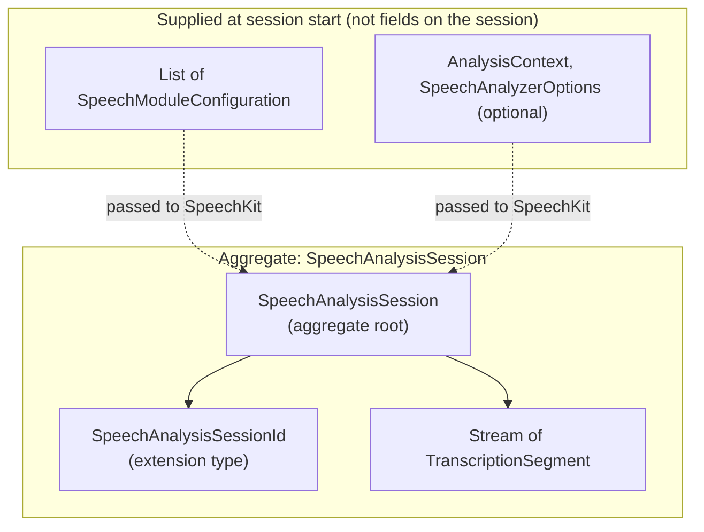

# Domain Model: Speech Analysis (SpeechAnalyzer pipeline)

This document describes the **bounded context**, **aggregate root**, **entities** (if any), and **value objects** for on-device speech analysis using Apple’s **`SpeechAnalyzer` + `SpeechTranscriber` + `AssetInventory`** APIs. **Scalar handles** use **Dart extension types** where appropriate; **multi-field** concepts use **immutable classes**.

## Bounded context

**Speech analysis (module pipeline)**: Configuring and running a **single** `SpeechAnalyzer` session (one input sequence at a time per Apple’s model), ensuring **locale assets** are available, feeding **time-coded audio** (`AnalyzerInput`), and consuming **module results** (e.g. transcription text and time ranges). Boundaries:

- **In scope**: Transcription-oriented modules (`SpeechTranscriber`, `DictationTranscriber`), optional `SpeechDetector`, **asset inventory** status/install, **session lifecycle** (analyze, finalize, cancel).
- **Out of scope**: Legacy **`SFSpeechRecognizer`** / task API; **translation**, **summarization**, **LLM post-processing**, and **arbitrary audio encoding**—callers handle those outside this package.
- **Apple types**: Domain names are **Dart** names; map to `SpeechAnalyzer`, `SpeechTranscriber`, `AssetInventory`, `AnalyzerInput` in infrastructure only.

---

## Aggregate: SpeechAnalysisSession (aggregate root)

**Aggregate root**: [`SpeechAnalysisSession`](../lib/src/application/speech_analysis_session.dart) — one logical analysis session per native `SpeechAnalyzer` run.

**Consistency boundary**: One session matches one native analyzer configuration for a **single input sequence**. The application-layer type exposes:

- Opaque **`SpeechAnalysisSessionId`** (native handle for finalize/cancel routing).
- **`Stream<TranscriptionSegment>`** for progressive results (immutable chunks; not stored inside a mutable aggregate graph).
- **`finalizeAndFinish`** / **`cancelAndFinishNow`** mapped to Apple’s `finalizeAndFinish` / `cancelAndFinishNow`.

Module lists (`List<SpeechModuleConfiguration>`) and optional `AnalysisContext` / `SpeechAnalyzerOptions` are supplied when **`SpeechKit`** starts analysis; they are not duplicated on `SpeechAnalysisSession` itself.

**Invariants**:

- Callers should ensure **assets** are ready (or use `ensureAssetsInstalled`) before analysis; the session type does not re-check inventory.
- **Finalize or cancel** is explicit for lifecycle control; cancel subscription as needed to match native teardown.
- **No legacy pipeline**: Domain and application layers do not model `SFSpeechRecognitionTask` or recognizer-centric flows.

**Lifecycle**: Native-driven; Dart exposes terminal operations on `SpeechAnalysisSession` rather than mirroring every internal state name.

---

## Entities

Prefer **value objects** and the **session aggregate** first. Add **entities** only when something has **identity** across time beyond the session. Currently **no extra entities** are required; **`SpeechAnalysisSession`** is the single root.

---

## Value objects

### Identifier / handle value objects (extension types)

| Value object | Representation | Purpose |
|--------------|----------------|---------|
| **SpeechAnalysisSessionId** | `extension type SpeechAnalysisSessionId(int)` | Opaque id for one session; `isValid` requires `value > 0`. |

### Configuration and status (immutable classes or enums)

| Value object | Purpose |
|--------------|---------|
| **SpeechModuleConfiguration** | Locale + module kind (transcriber, dictation, speech detector) and presets/options for native module construction. |
| **AssetInventoryStatus** | Model-install state relevant to callers (mirrors `AssetInventory.Status` conceptually). |
| **AnalysisContext** | Optional contextual strings for biasing recognition. |
| **SpeechAnalyzerOptions** | Optional `SpeechAnalyzer.Options` mapping (task priority, model retention). |

### Result chunks (immutable classes)

Module results are **streamed** as **immutable value objects** for Dart `Stream` consumers.

| Value object | Purpose |
|--------------|---------|
| **TranscriptionSegment** | Text plus timing metadata from `SpeechTranscriber` results in infrastructure. |

Use Dart `Duration` or dedicated time-range types with validation (finite, non-negative length) as appropriate.

---

## Domain errors

- **`SpeechKitException`** in **domain/errors/**: user-meaningful failures (permission denied, unsupported OS, unsupported locale, asset install failure, analyzer errors). Infrastructure maps native errors into this type.

---

## Rules

1. **No legacy API in domain/application**: Do not model `SFSpeechRecognizer`, `SFSpeechRecognitionRequest`, or task delegates as first-class domain types.
2. **Session boundary**: Treat **one `SpeechAnalyzer` session** as the **aggregate** consistency boundary; do not split the same native session across multiple roots.
3. **Streamed results**: Transcription (and other module) outputs are **value objects** emitted over time; they are **not** part of the aggregate’s persisted in-memory graph (same idea as `CapturedFrame` vs `ShareableContent` in screen-capture-kit).
4. **Extension types**: Use **extension types** for opaque scalar handles; use **immutable classes** for multi-field configuration and results.
5. **Pure domain**: No `dart:io`, `dart:ffi`, or Swift/ObjC interop in **domain/**.

---

## File placement (`lib/src/domain/`)

- `domain/entities/` — add only when a real entity with identity is needed (optional).
- `domain/value_objects/identifiers/` — e.g. `speech_analysis_session_id.dart`.
- `domain/value_objects/configuration/` — module configuration, analyzer options, custom language model export, etc.
- `domain/value_objects/results/` — e.g. `transcription_segment.dart`.
- `domain/errors/speech_kit_exception.dart`.

**Maintenance**: When adding a new public value object or changing the session contract, update this document and [`.cursor/skills/speech-kit-api-coverage/SKILL.md`](../.cursor/skills/speech-kit-api-coverage/SKILL.md) if Apple API coverage is affected.
